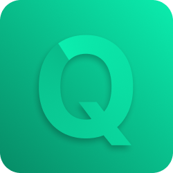

<div align="center">
    <a href="https://github.com/imadatyatalah/quotes/">
        
    </a>
    <h1 align="center">Quotes</h1>
    Keep your quotes in one place, Share them with your friends.
</div>

<div align="center">

<a href="https://quotes.imadatyat.me">View Demo</a>
·
<a href="https://github.com/imadatyatalah/quotes/issues">Report Bug</a>
·
<a href="https://github.com/imadatyatalah/quotes/issues">Request Feature</a>

</div>

## About The Project

Quotes is a simple web application that allows you to store your quotes and share them with your friends.

### The Idea

The idea came up after I started writing a quote that I found on the internet in my to-do list app 😆 and I thought why not create a quotes app, Similar to a to-do list app but it's made for quotes instead of tasks.

## Tech Stack

- [Next.js](https://nextjs.org/) – framework
- [TypeScript](https://www.typescriptlang.org/) – language
- [Tailwind CSS](https://tailwindcss.com/) – CSS
- [Next Themes](https://github.com/pacocoursey/next-themes) – dark mode
- [shadcn/ui](https://ui.shadcn.com/) – UI library
- [Vercel](https://vercel.com/) – deployments

## Getting Started

```
git clone https://github.com/imadatyatalah/quotes.git
cd quotes
pnpm i
pnpm dev
```

Create a `.env.local` file similar to `.env.example`.

## License

Distributed under the MIT License. See [`LICENSE`](https://github.com/imadatyatalah/next.js-tailwindcss-template/blob/main/LICENSE) for more information.
